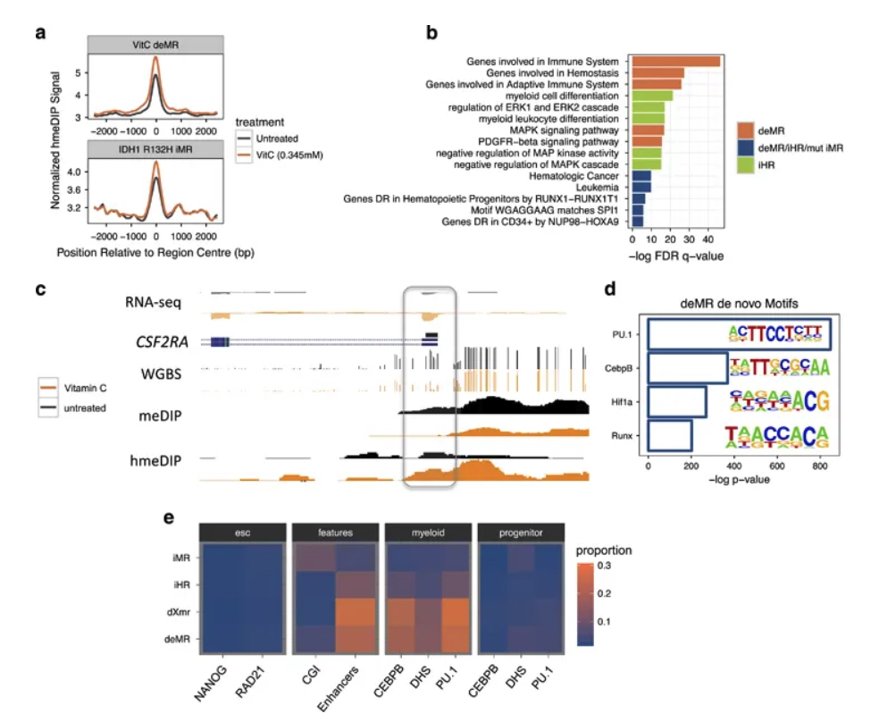
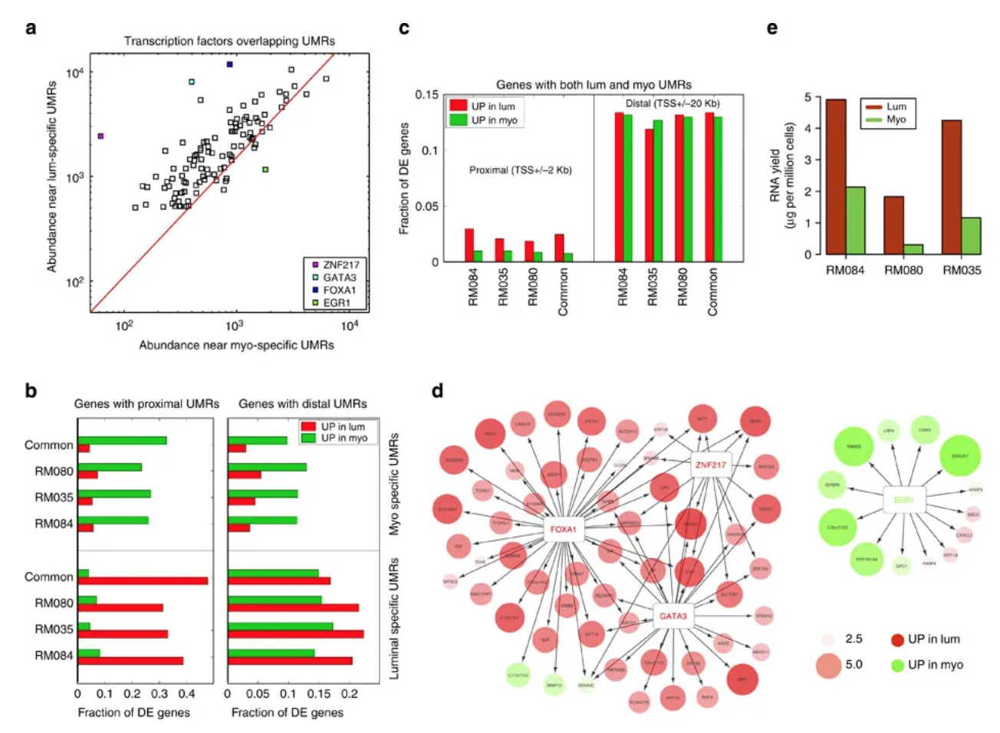

## Research

See my [Google Scholar Profile](https://scholar.google.com/citations?user=3ygGp74AAAAJ&hl=en) for a complete list of my publications.

### Vitamin C-induced epigenomic remodelling in IDH1 mutant acute myeloid leukaemia

M Mingay et al.

---

##### Vitamin C induces methylome remodelling in IDH1 R132H-expressing cells

##### Vitamin C treatment leads to demethylation at enhancers that become active in the myeloid lineage specifically

---

### Epigenetic and transcriptional determinants of the human breast

---

##### Intron retention and mammary cell type-specific miRNAs and long noncoding RNAs.

##### Regulatory asymmetry between myoepithelial and luminal cell types.

---

### Epigenetic therapy restores normal hematopoiesis in a zebrafish model of NUP98–HOXA9-induced myeloid disease

##### DAC and Indo function synergistically with VPA to restore hematopoiesis in NHA9 transgenic zebrafish

---

