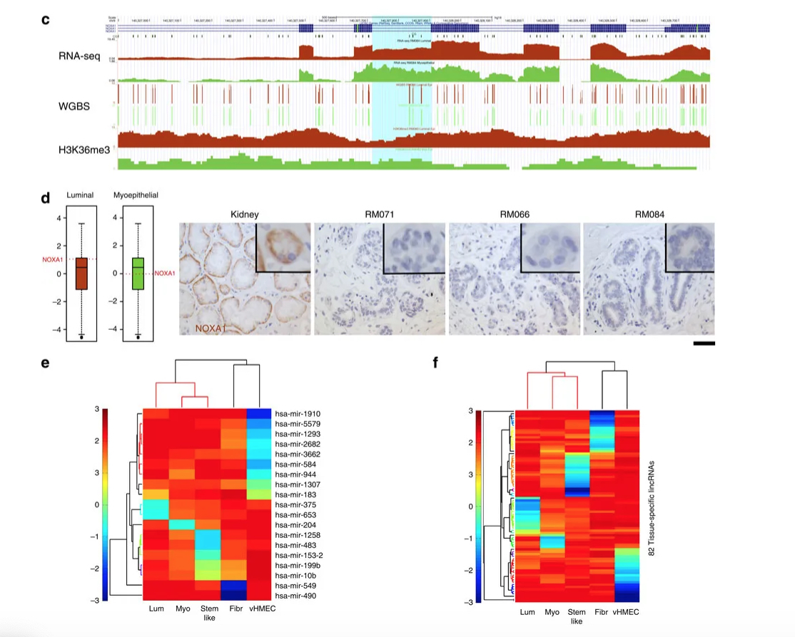
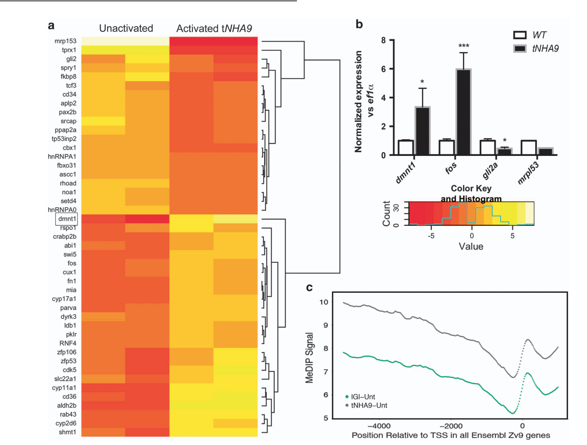

# Research

See my [Google Scholar Profile](https://scholar.google.com/citations?user=3ygGp74AAAAJ&hl=en) for a complete list of my publications.

---

Vitamin C induced epigenomic remodelling in *IDH1* mutant acute myeloid leukaemia [*Nature Leukemia*](https://www.nature.com/articles/leu2017171)

**Figure 2.** Vitamin C induces methylome remodelling in *IDH1 R132H* expressing cells

**Figure 3.** Vitamin C treatment leads to demethylation at enhancers that become active in the myeloid lineage specifically

---

Epigenetic and transcriptional determinants of the human breast [*Nature Communications*](https://www.nature.com/articles/ncomms7351)

**Figure 2.** Intron retention and mammary cell type-specific miRNAs and long noncoding RNAs.

**Figure 3.** Regulatory asymmetry between myoepithelial and luminal cell types.

---

Epigenetic therapy restores normal hematopoiesis in a zebrafish model of *NUP98–HOXA9* induced myeloid disease [*Nature Leukemia*](https://www.nature.com/articles/leu2015126?WT.ec_id=LEU-201510&spMailingID=49718101&spUserID=ODkwMTM2NjMwMQS2&spJobID=780949979&spReportId=NzgwOTQ5OTc5S0)

**Figure 3.** Microarray analysis identifies overexpression of *DNMT1*. 

**Figure 4.** DAC and Indo function synergistically with VPA to restore hematopoiesis in *NHA9* transgenic zebrafish

---

